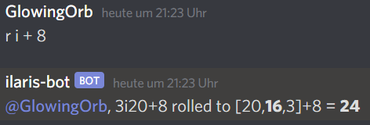

# Ilaris Bot

This is a Discord dice bot for the fan-made Ilaris rule variant of the pen and paper rpg "The Dark Eye" (See https://ilarisblog.wordpress.com/)

## Prerequisites:

1. A Discord account, and a server where you are allowed to invite bots
2. A registered discord application with a bot user (See https://discordjs.guide/preparations/setting-up-a-bot-application.html#creating-your-bot)
3. The bot user must have been added to your server (See https://discordjs.guide/preparations/adding-your-bot-to-servers.html#bot-invite-links)
4. Node.js

## Installing the bot 

1. Create a file ".env" on root of this project (next to this file)
2. In the ".env" file put the following:
    `TOKEN=YourBotTokenHere`
3. Replace YourBotTokenHere with the token of your discord bot (See https://discordjs.guide/preparations/setting-up-a-bot-application.html#your-token)
4. run `npm install` to install required dependencies
5. (optional) run `npm test` to verify the local installation

## Starting the bot

1. Run `npm start`
2. The bot should now be online on your server
3. (optional) In a text channel where the bot can read and write type the message `ping`. The bot should reply with `pong`.

## Using the bot

The bot reacts to chat messages that consist of the single letter `r` (or `roll`, `/r` or `/roll`) followed by a space and dice instructions.
E.g. `r d20` to roll a simple 20-sided die.

The bot also reacts to dice instructions without the preceding command (e.g.  just `d20`), but will not respond on invalid dice instructions in this case but stay silent instead.

### Rolls
Supported rolling instructions are:
1. ndm (e.g. `r 3d20`), this will roll n m-sided dice. n can be omitted and will default to 1.
m can be omitted and will default to 20. i.e. `r d` is the same as `r 1d20`. This could be used for quickly rolling attacks.
2. nim (e.g. `r 3i20`), this will roll n m-sided dice, but in ilaris-style (only the second highest die counts)
n can be omitted and will default to 3.
m can be omitted and will default to 20. i.e. `r i` is the same as `r 3i20`. This could be used for quickly rolling default ilaris checks.
3. nsm (e.g. `r 3s6`), this will roll n m-sided dice, but in shadowrun(5)-style (all dice greater than 4 count as hit).
n can be omitted and will default to 1.
m can (and usually should) be omitted and will default to 6. i.e. `r s` is the same as `r 1s6`.

Additionally, fixed values can be added (e.g. `r 4i + 8`). This could be used to apply a bonus to a check. 

### Checks
You can use comparison operators (>, >=, <, <=, ==) to automatically do skills checks, both against fixed values as well as other rolls.

e.g. `i + 8 >= 16` or `i + 12 >= i + 10`  
